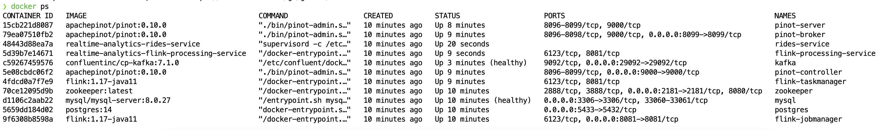
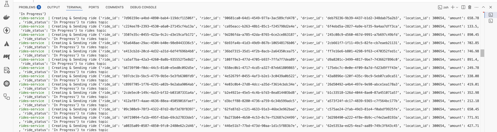
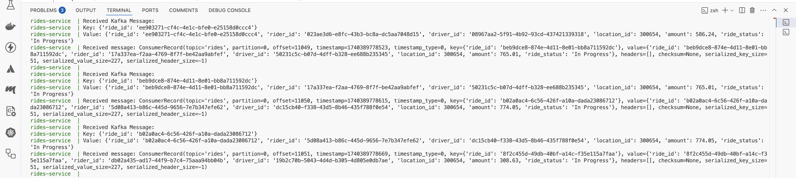
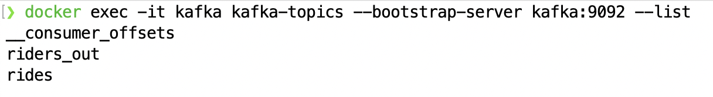
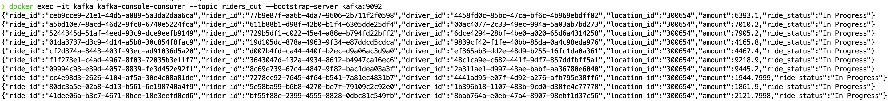
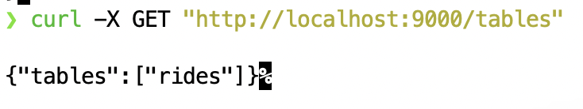
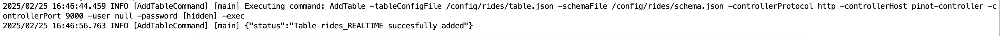
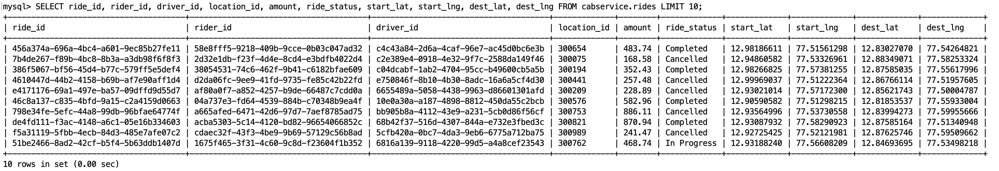
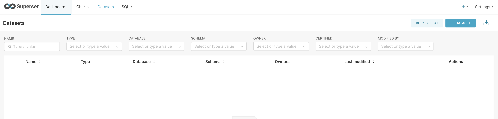
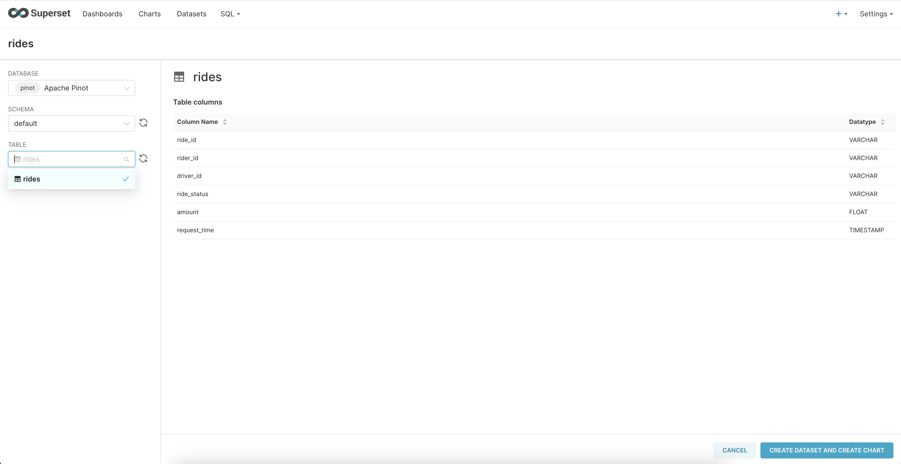

README
# Realtime Data Streaming

## Overview

In modern data-driven applications, real-time data streaming has become a critical requirement for processing, analyzing, and storing large volumes of continuously generated data. 

This setup ensures scalable, low-latency, and fault-tolerant data streaming for real-time analytics and operational insights.

This streaming pipeline uses **Kafka**, **Flink**, **Apache Pinot**, **PostgreSQL**, and **MySQL**, leveraging both **Python and Java**, with everything provisioned using **Docker Compose** for seamless deployment and orchestration. 

1. Kafka serves as the central event broker, enabling efficient data ingestion and movement across systems. 
2. Apache Flink, a powerful stream processing framework, transforms and enriches incoming data in real-time before routing it to different storage systems. 
3. For fast analytical queries, Apache Pinot provides an OLAP engine optimized for high-speed aggregations
4.  PostgreSQL and MySQL act as traditional relational stores for structured and transactional data. 
5. Python and Java, we implement producers, consumers, Flink processing jobs, and seamless integration with storage layers. 

## Prerequisites

Make sure you have the following installed:

- [Docker](https://docs.docker.com/get-docker/)
- [Docker Compose](https://docs.docker.com/compose/install/) 
- [Python 3.x](https://www.python.org/downloads/) 
- [Java 8/11](https://www.oracle.com/java/technologies/javase/jdk11-archive-downloads.html) (for running Flink jobs)
- [Git](https://git-scm.com/downloads)

## Installation & Setup

### 1. Clone the Repository

```bash
git clone https://github.com/Nasruddin/realtime-streaming-kafka-flink-pinot-postgres.git

cd realtime-streaming-kafka-flink-pinot-postgres
```

### 2. Start Services using Docker Compose

```bash
docker compose \ 
    -f docker-compose-base.yml \
    -f docker-compose-pinot.yml \ 
    -f docker-compose-flink.yml  up --build
```

This will start **Kafka, Zookeeper, Flink, Pinot, PostgreSQL, and MySQL** containers.

### 3. Verify Running Services

Run the following commands to check if the services are up:

```bash
docker ps
```

You should see containers for **Kafka, Zookeeper, Flink, Pinot, PostgreSQL, and MySQL** running.



## Running the Pipeline

### 1. Produce Sample Data to Kafka

As soon as containers start running, data(1000 rides row) will be ingested to MySQL and evently will be publish to Kafka as an events. Once all the 1000 rides are pushed to Kafka, Python Kafka producer will start creating new events. You can verify in the ride service logs
```bash
docker logs rides-service
```
#### Producer
---


#### Consumer 
---



### 2. Flink Job

Confirm that your flink job is running and producing transformed events
#### List the topics to confirm new realtime topic is created 
```bash
docker exec -it kafka kafka-topics --bootstrap-server kafka:9092 --list
```


#### Verify the events are getting generated

```bash
docker exec -it kafka kafka-console-consumer --topic riders_out --bootstrap-server kafka:9092 
```


### 3. Query Apache Pinot

Make sure schema and table is added
```bash
curl -X GET "http://localhost:9000/schemas"
```

```bash
curl -X GET "http://localhost:9000/tables"
```


NOTE - If you don't find schemas and table then re-run below image:
```bash
docker-compose restart pinot-add-table
```


#### Once the data is processed and stored in **Apache Pinot**, query it using:

```bash
curl -X POST "http://localhost:9000/query/sql" -H "Content-Type: application/json" -d '{"sql":"SELECT * FROM rides LIMIT 10"}'
```
or 

## Running Queries
### Open Pinot UI (localhost:9000)
#### Query Pinot:
```sql
SELECT * FROM rides LIMIT 10;
```


### 4. Query PostgreSQL

Access the databases with:

```bash
docker exec -it postgres psql -U postgresuser -d rides_db
```



### 5. Dashboard on Superset
##### Connect to Pinot and create dataset


##### Verify dataset


## Stopping and Cleaning Up

To stop the containers without deleting data:

```bash
docker compose \
    -f docker-compose-base.yml \
    -f docker-compose-pinot.yml \
    -f docker-compose-flink.yml  down
```

To stop and remove all containers, volumes, and networks:

```bash
docker compose \
    -f docker-compose-base.yml \
    -f docker-compose-pinot.yml \
    -f docker-compose-flink.yml  down -v
```

## Troubleshooting

- Check logs of a specific service:
  ```bash
  docker logs -f <container_id>
  ```
- Restart a specific service:
  ```bash
  docker-compose restart <service-name>
  ```
- Ensure ports are not occupied:
  ```bash
  sudo lsof -i :<port>
  ```
  Then kill the process:
  ```bash
  sudo kill -9 <PID>
  sudo kill -15 <PID>
  ```
- Kafka Specific 
  ```bash
  docker stop kafka zookeeper 
  docker rm kafka zookeeper
  ```
  ZooKeeper stores broker metadata under /tmp/zookeeper, so you need to clear it:
    ```bash
    rm -rf /tmp/zookeeper
    ```
  Kafka maintains log data, which might be causing conflicts. Delete the Kafka log directory:
    ```bash
    rm -rf /tmp/kafka-logs  
    ```
## Contributing

Feel free to fork this repository and submit pull requests with improvements.


